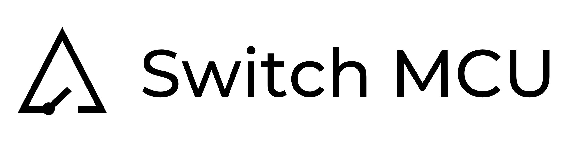
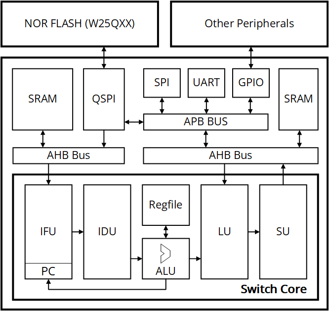

**About “Switch”**

- More leeway
   than "Open”.
- I don't want to
   use the guise of open source, maybe one day it will be closed source.

**Architecture**

- Harvard
   architecture RISC-V Microcontroller.
- Support 5-stage
   pipeline.
- ITCM/DTCM
   memory for instruction/data storage.
- AMBA AHB bus
   used for CPU and memory.
- AMBA APB bus
   used for peripherals.
- Support UART,
   SPI peripherals.
- Temporarily no
   cache and MMU.

**Debug**

- Support ICP(In
   Circuit Programing) and ISP(In System Programing).
- Support OpenOCD
  + GDB for programming and debugging.
- Use the JTAG
   protocol (this is probably the most difficult part).

**Toolchain and reference**

- Icarus Verilog
- Verilator
- GTKWave
- RISC-V GNU
   Toolchain
- Sifive Freedom
   E SDK
